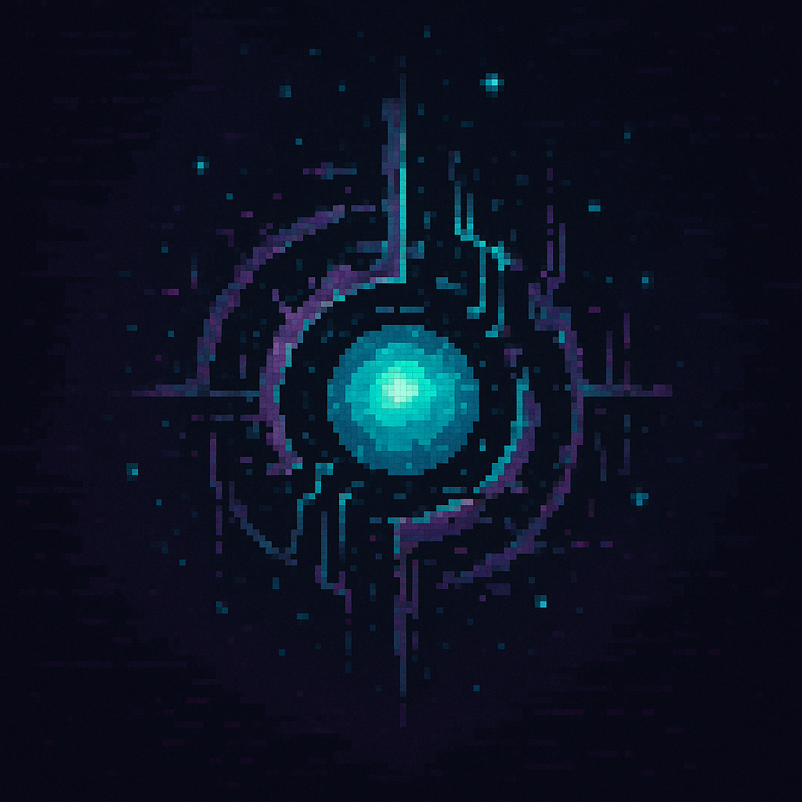

  

<h1 align="center">Nullcore – Where Reality Breaks, and You Play the Bug</h1>

  <em>Dive into Nullcore, a mind-bending 2D glitch-world where you don’t just survive chaos—you embrace it. Vote on bugs, manipulate physics, and explore surreal worlds that evolve with every action. Glitches aren’t errors here—they’re your power.</em>

## 🕹️ Nullcore – Game Overview

**Nullcore** is a 2D glitchpunk adventure set in a broken simulation where chaos isn’t the enemy—it’s the mechanic. Players navigate through surreal worlds warped by dynamic, community-driven glitches. From gravity reversals to time loops, no two sessions are ever the same. Every world in Nullcore is alive, reactive, and completely unpredictable—just like the bugs controlling it.

Whether you’re solving logic-defying puzzles, collecting Glitch Tokens, or collaborating with others to shape the next anomaly, Nullcore offers an immersive sandbox of absurdity, strategy, and creativity.

## 🔧 **Gameplay Mechanics**

- **🌀 Dynamic Glitch Engine**  
  Core gameplay is driven by real-time, randomly or community-triggered glitches that change how the world behaves.

- **👾 Glitch Voting System**  
  Let the players decide the next bug in the system. The majority rules… for better or for utter chaos.

- **⚔️ Multiplayer Mayhem** _(Coming Soon)_  
  Engage in co-op or competitive modes where glitch mechanics add layers of strategy—and sabotage.

- **⏱️ Time-Based Events**  
  Temporary world effects create high-stakes moments and keep gameplay fresh.

- **📊 Glitch Level Meter**  
  A visual bar indicating how unstable your current world is—brace for impact as it fills.

## 🌍 **World & Environment**

- **🗺️ Surreal 2D Worlds**  
  Explore handcrafted pixel-art environments with unique glitch-infused designs.

- **🧠 Puzzle + Platforming Hybrid**  
  Each level blends brain-bending puzzles with tight platforming, twisted by unpredictable physics.

- **🔄 Reactive World Design**  
  Every glitch changes how you interact with the world—jumping, climbing, and even time itself.

## 🧍 **Player Progression**

- **🏆 Glitch Token Economy**  
  Earn tokens by surviving glitches, completing objectives, or just embracing the madness.

- **🧍 Character Customization**  
  Unlock a wide variety of glitch-themed outfits, effects, and animated emotes.

- **🎮 Power-ups & Items**  
  Collect world-specific abilities like _Gravity Boots_ or _Lag Bombs_ to navigate glitch terrain.

## 🎨 **Visuals & Immersion**

- **🖼️ Consistent Pixel Art Style**  
  Retro-inspired 2D visuals with modern animations and UI overlays.

- **🎛️ Immersive HUD**  
  The in-game interface is minimal yet reactive, displaying live glitch effects, timers, and world stats.

- **💥 Visual Chaos Aesthetic**  
  Embrace a design philosophy where errors become beautiful—glitch animations, broken textures, and screen tears are part of the art.

## 🚀 Tech Stack

| Layer          | Technology                                       | Purpose / Notes                                                          |
| -------------- | ------------------------------------------------ | ------------------------------------------------------------------------ |
| **Frontend**   | React / Next.js                                  | Building a performant, reactive web-based game interface                 |
|                | TypeScript                                       | Type-safe development for scalability and maintainability                |
|                | Tailwind CSS                                     | Rapid UI styling with a consistent design system                         |
|                | Canvas / WebGL (via Kontra.js, Phaser or PixiJS) | 2D rendering engine for game visuals                                     |
|                | Zustand / Redux                                  | Global state management for glitch logic, UI, and player states          |
| **Game Logic** | Custom Game Engine (JS-based)                    | Handles glitches, physics, and interactive elements                      |
|                | GLSL (optional)                                  | Shader effects for visual glitches (optional but immersive)              |
| **Backend**    | Node.js                                          | Handles player sessions, real-time logic, multiplayer sync (future)      |
|                | Express.js                                       | API routes for leaderboard, player data, voting, etc.                    |
|                | Firebase / Supabase                              | Authentication, real-time database, and hosting for MVP                  |
| **Blockchain** | Monad                                            | On-chain logic for Glitch Token economy and decentralized events         |
|                | Ethers.js / Monad SDK                            | Smart contract interaction, token balance, voting system                 |
| **Storage**    | IPFS / Filecoin                                  | Hosting immutable assets like avatars, glitch metadata, and collectibles |
|                | Firebase Storage (MVP)                           | Lightweight and easy for early asset delivery                            |
| **Deployment** | Vercel / Netlify                                 | Frontend hosting and CI/CD integration                                   |
|                | Docker                                           | Containerization for scalable backend services                           |
| **Design**     | Figma / Penpot                                   | UI/UX prototyping and pixel-perfect screen design                        |
|                | Aseprite / Piskel                                | Pixel art asset creation and sprite animations                           |

## 📄 License

MIT © [Mohd Aqdas Asim]. Feel free to use, fork, and remix with attribution.

## 📨 Stay Connected

Follow our journey on:

- 🌐 Website (coming soon!)

> _"In Nullcore, reality isn’t broken — it’s just evolving. Embrace the bugs. Rewrite the rules."_
